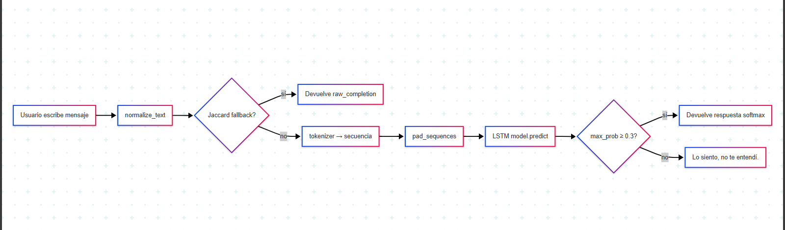

# Python-Text-Prediction-Model-Private
Python Text Prediction Model with TensorFlow/Keras A sequence-to-sequence text prediction model built with Python and TensorFlow/Keras, designed for conversational AI applications.


# 🤖 Chatbot LSTM “TensenBot”

Un pequeño chatbot basado en un Bidirectional LSTM con fallback por Jaccard, entrenado sobre tus propios pares prompt→respuesta.

---

## 🛠️ Tecnologías & Stack

-  **Python 3.8+**  
-  **TensorFlow 2 / Keras**  
-  **NumPy**  
-  **scikit-learn**  
-  (opcional)  
-  **Control de versiones**

---

## 📁 Estructura del bot diagrama


---

## 🔧 Configuración del entorno

1. Clona este repositorio:
    ```bash
   $ git clone https://github.com/Erick-MC-Cedeno/Python-Text-Prediction-Model-Private


1. Clona este repositorio:
    ```bash
   $ git clone https://github.com/Erick-MC-Cedeno/Python-Text-Prediction-Model-Private

2. Ubicate en Path
   ```bash
   $ cd Python-Text-Prediction-Model-Private
    ```

3. Instala las dependencias:
    ```bash
   $ pip install -r requirements.txt
    ```

4. Inicia el modelo de chatbot:
    ```bash
   $ python model.py
    ```


